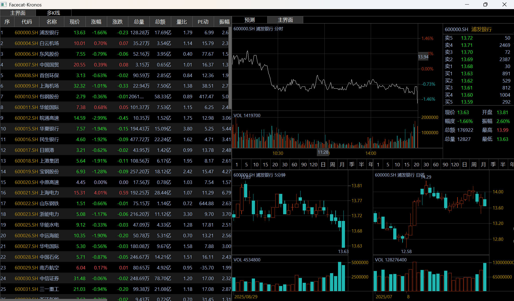
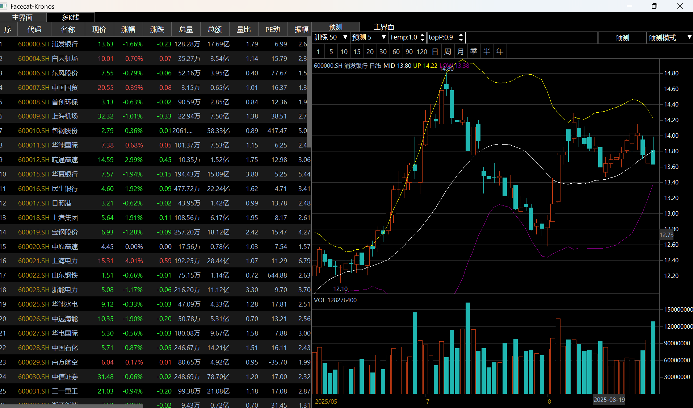
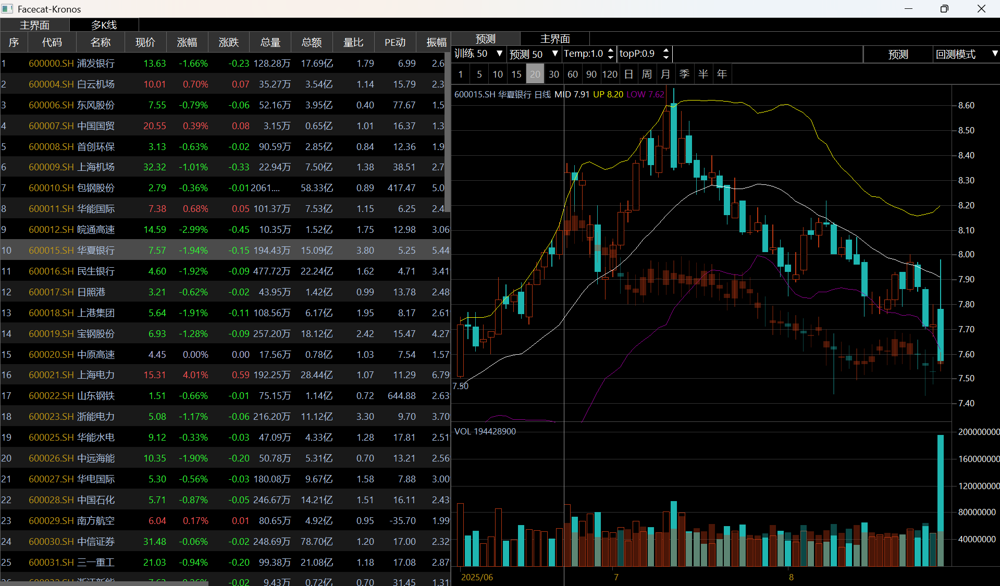

# FaceCat-Kronos: Financial Quantitative Forecasting Tool

## About This Project

**FaceCat-Kronos** is a financial quantitative tool developed by the **Huajuanmao Quantitative Research Team**. This project is built upon **Kronos**, the latest open-source K-line forecasting framework from Tsinghua University. It integrates advanced artificial intelligence technology, aiming to provide scientific analysis and prediction capabilities for the financial market.

This tool can perform in-depth pre-training on historical stock data for market-maker K-line planning and deduce future market trends. Whether you are a mutual fund, a private equity firm, or a professional stock recommendation agency, FaceCat-Kronos can provide you with K-line charting capabilities and serve as an assistant for market insights.

## Core Features

*   **Future K-Line Prediction**: Utilizes the Kronos framework to predict multi-dimensional data such as future stock price trends and trading volumes, generating virtual K-lines.
*   **Historical Data Backtesting**: Validates the accuracy of the prediction model on historical data, allowing for an intuitive comparison between predicted and actual trends.
*   **Multi-Period K-Line Analysis**: Provides various K-line panels, including intraday, daily, weekly, and monthly charts, to meet the needs of different trading strategies.
*   **Interactive Charts**: A clean and intuitive graphical user interface that supports clicking to switch stocks, adjusting prediction parameters, and other convenient operations.
*   **Flexible Parameter Tuning**: Supports adjusting parameters like `Temperature` and `top_p` (nucleus sampling) to control the behavior of the prediction model.

## Software Interface

### Main Interface


### Prediction Interface


### Prediction Mode


### Backtesting Mode


### Multi-Period K-Line Panel


## Our Team

The members of the Huajuanmao Quantitative Research Team come from the quantitative departments of domestic and international financial institutions and technology companies:

*   Great Wisdom (Longtop)
*   East Money
*   Soochow Securities
*   GF Securities
*   Donghai Securities
*   Shanxi Securities
*   Xiangcai Securities
*   Huatai Securities
*   Hengtai Futures
*   Deutsche Bank

The systems or modules developed by our members have been used by a majority of securities and futures companies, mutual funds, private equities, and professional investors. We are committed to integrating cutting-edge AI technology with market understanding to provide decision-support tools for professional investors.

## Quick Start

Before you begin, please read the following points to avoid unnecessary issues:

1.  **Python Version**: Python 3.10+ is officially recommended.
2.  **Platform**: The original code defaults to using an NVIDIA CUDA GPU (`device="cuda:0"`). If you are a Mac user or a Windows/Linux user without an NVIDIA graphics card, running it directly will cause an error. The tutorial includes modified code to enable CPU execution.
3.  **Dependency Installation**: `requirements.txt` might be missing the indirect dependency `safetensors`, which we have added to the installation steps.
4.  **Running Path**: Be sure to execute commands in the correct directory to avoid path-related errors.

### Deployment and Operation

1.  **Download the Project**
    *   Visit the [FaceCat-Kronos GitHub repository](https://github.com/Fidingks/facecat-kronos) to download the ZIP package, or clone it using Git.
    *   After unzipping, open the project folder with VSCode or another IDE.

2.  **Install Dependencies**
    ```bash
    # Install using the requirements file
    pip install -r requirements.txt
    
    # Install the potentially missing package
    pip install safetensors
    ```

3.  **Run the Official Example (Optional)**
    *   If your machine is equipped with an NVIDIA GPU, you can run the official example first to verify the environment.
    ```bash
    cd examples
    python prediction_example.py
    ```
    *   If your computer does not have a compatible GPU, please use the modified CPU version examples we provide (`cpu_prediction_example.py`, `cpu_prediction_wo_vol_examples.py`).
    *   After a successful run, you can compare your output with the `prediction_example.png` image in the `figures` directory.

4.  **Run FaceCat-Kronos**
    *   First, ensure you are in the project's root directory.
    ```bash
    # Change to the facecat directory
    cd facecat
    
    # Run the main program
    python main.py
    ```

### Usage Instructions

*   **Prediction/Backtesting**: After launching the program, click the **"Predict"** button on the right to use historical data to forecast future trends. The virtual K-lines to the right of the separator line are the prediction results. You can also switch to **"Backtesting Mode"** from the dropdown menu to compare with historical data.
*   **Switching Stocks**: Click on any stock in the table on the left of the main interface to load and analyze its data.
*   **Parameter Tuning**:
    *   `T` (Temperature): Range 0-100. A higher value leads to bolder and more diverse predictions.
    *   `topP` (Top-p/Nucleus Sampling): Range 0-1. A higher value makes the model's choices more concentrated on high-probability options, resulting in more plausible outcomes.
*   **Interface Navigation**:
    *   **Prediction Interface**: Use daily K-lines for historical backtesting or future prediction.
    *   **Main Interface**: Includes the core stock list, intraday chart, Level 2 order book panel, and multi-period K-line chart.
    *   **Multi K-Line**: A separate panel for multi-period K-line analysis.
