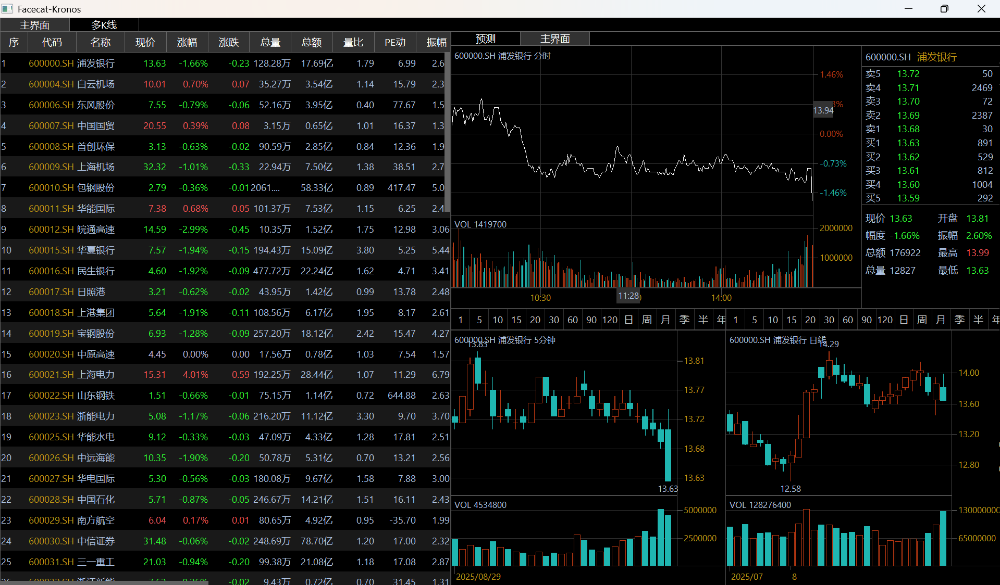
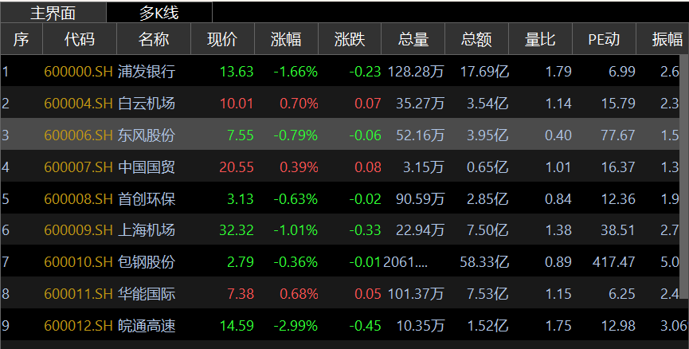
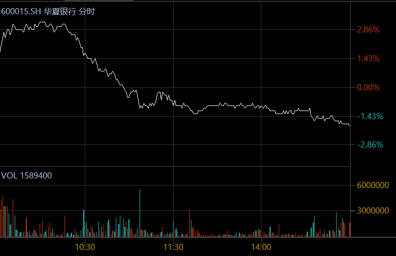
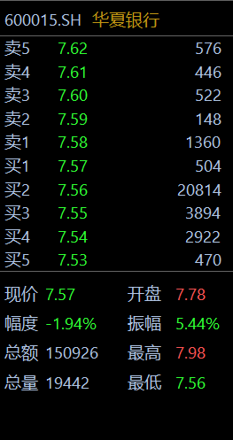
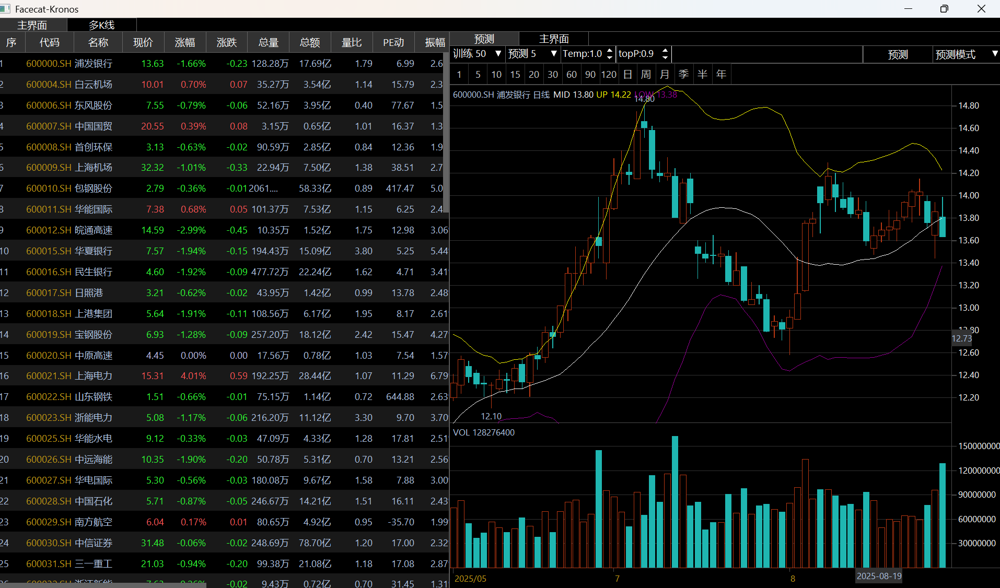
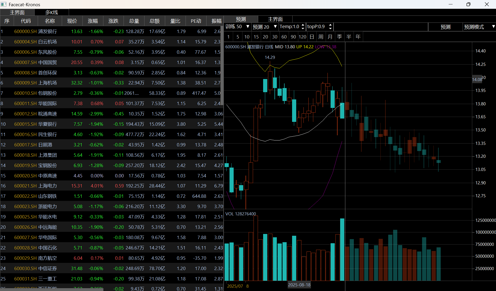
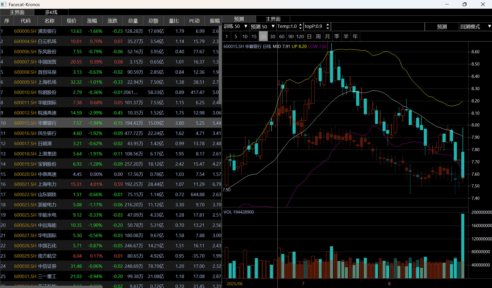
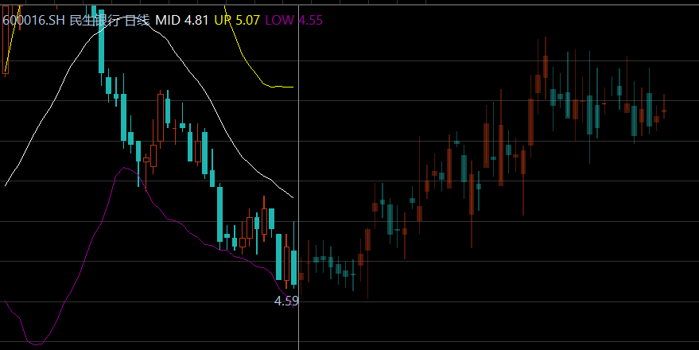
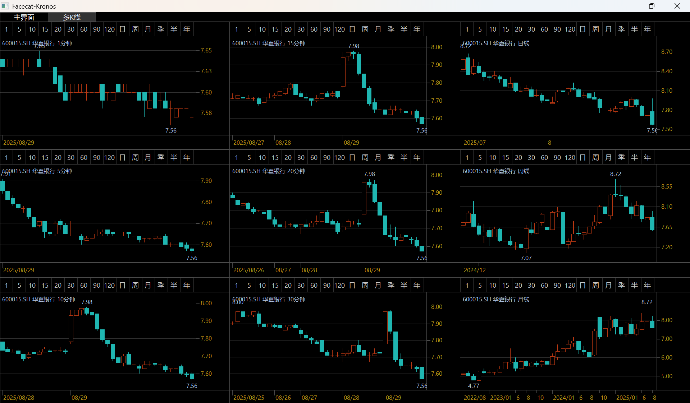
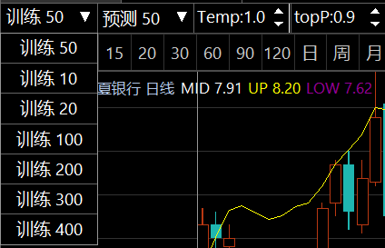

# FaceCat-Kronos 金融量化预测工具

## 项目简介

**FaceCat-Kronos** 是由 **花卷猫量化研究团队** 打造的一款金融量化工具。本项目基于清华大学最新开源的K线预测框架 **Kronos**，融合了前沿的人工智能技术，旨在为金融市场提供科学的分析与预测能力。

本工具能够对股票历史数据进行深度预训练，实现精准的做市商K线规划，并对未来市场走势进行科学推演，适用于量化研究、策略研发、交易决策支持、投研汇报、教学演示、二次开发。无论是基金、私募、荐股机构、专业投资者，或是量化研究员、业余爱好者，FaceCat-Kronos 都能为您提供k线做图能力，成为洞察市场的助手。

## 使用技术

*   **花卷猫Python**: 由花卷猫量化研究团队自研的图形框架，本项目UI(k线、图表、指标)全部由该框架实现。
*   **PySide**: 可在MacOs上运行。
*   **Kronos**: 清华K线预测模型。

## 数据源

股票数据全部来自 **花卷猫量化研究团队** 自研的行情服务器，项目地址 [stockquote行情服务端]("https://jjmfc.com/software/stockquote.zip") ，可下载后部署在自己的服务器。

## 核心功能

*   **未来K线预测**: 利用Kronos框架，对未来股价走势、成交量等进行多维度预测，生成虚拟K线。
*   **历史数据回测**: 在历史数据上验证预测模型的准确性，直观比较预测结果与真实走势。
*   **多周期K线分析**: 提供分时、日线、周线、月线等多周期K线面板，满足不同策略的分析需求。
*   **交互式图表**: 简洁直观的图形化界面，支持点击切换股票、调整预测参数等便捷操作。
*   **灵活参数调整**: 支持调整 `Temperature` (温度) 和 `top_p` (核心采样) 等参数，控制预测模型的行为。

## 软件界面

### 主界面


### 代码表


### 分时图


### 五档行情


### 预测界面


### 预测模式


### 回测模式


### 预测k线


### 多K线面板


### 训练参数


## 我们的团队

花卷猫量化研究团队的成员均来自国内外金融机构及科技公司的量化部门：

*   大智慧（龙软）
*   东方财富
*   东吴证券
*   广发证券
*   东海证券
*   山西证券
*   湘财证券
*   华泰证券
*   恒泰期货
*   德意志银行

期间参与研发的系统或模块被大部分的证券期货公司、公募基金、私募或专业投资者使用，我们致力于将前沿的AI技术和市场理解融合，为专业投资者提供决策支持工具。

## 快速开始

在开始之前，请先阅读以下几点，这能帮助您避免很多不必要的麻烦：

1.  **Python 版本**: 官方建议使用 Python 3.10+。
2.  **运行平台**: 原始代码默认使用 NVIDIA CUDA GPU (`device="cuda:0"`)。如果您是 Mac 或没有 NVIDIA 显卡的 Windows/Linux 用户，直接运行会报错。教程附有修改后的代码，使CPU也能顺畅运行。
3.  **依赖安装**: `requirements.txt` 中可能遗漏了间接依赖 `safetensors`，我们已在安装步骤中补充。为加速下载，建议使用国内镜像源。
4.  **运行路径**: 请务必在正确的目录下执行命令，避免出现路径错误。

### 部署与运行

1.  **下载项目**
    *   访问 [facecat-kronos GitHub 仓库](https://github.com/Fidingks/facecat-kronos) 下载ZIP包，或使用 Git 克隆。
    *   解压后，使用 VSCode 或其他IDE打开项目文件夹。

2.  **安装依赖包**
    ```bash
    # 使用清华镜像源安装
    pip install -r requirements.txt -i https://pypi.tuna.tsinghua.edu.cn/simple
    
    # 安装可能遗漏的包
    pip install safetensors -i https://pypi.tuna.tsinghua.edu.cn/simple
    ```

3.  **运行官方示例 (可选)**
    *   如果您的设备配有NVIDIA GPU，可以先运行官方示例以验证环境。
    ```bash
    cd examples
    python prediction_example.py
    ```
    *   若电脑无兼容的GPU，请使用我们提供的已修改好的CPU版本示例 (`cpu_prediction_example.py`, `cpu_prediction_wo_vol_examples.py`)。
    *   可能会出现无法加载在线模型，请到https://huggingface.co/NeoQuasar/Kronos-small/tree/main 下载模型放到model目录下
    *   运行成功后，可以与在 `figures` 目录下的 `prediction_example.png` 图片进行对比。

4.  **运行 FaceCat-Kronos**
    *   首先确保您位于项目的根目录。
    ```bash
    # 切换到 facecat 目录
    cd facecat
    
    # 运行主程序
    python main.py
    ```

### 使用说明

*   **预测/回测**: 启动程序后，点击右侧的 **“预测”** 按钮，即可使用历史数据预测未来走势。分割线右侧的虚K线即为预测结果。您也可以在下拉菜单中切换至 **“回测模式”**，进行历史数据比对。
*   **切换股票**: 在主界面左侧的表格中点击任意股票，即可加载并分析其数据。
*   **参数调整**:
    *   `T` (Temperature/温度): 范围0-100，数值越大，预测结果越大胆、越发散。
    *   `topP` (Top-p/概率阈值): 范围0-1，数值越大，模型选择的候选项越集中于高概率范围，结果更趋于合理。
*   **界面导航**:
    *   **预测界面**: 使用日k线进行历史回测或者未来预测
    *   **主界面**: 包含核心的股票列表、分时图、五档行情面板和多周期K线图。
    *   **多K线**: 独立的多周期K线分析面板。

